# Games

My collection of games.

All these games are licenced under the GPL 3.0 licence.

This page consists of:

 * Gallery: graphical overview of all my games
 * Build statuses: show the build statuses of all of my games

## Gallery

Ordered alphabetically

### [AminoAcidFighter](https://github.com/richelbilderbeek/AminoAcidFighter)

### [Beer simulation game](https://github.com/richelbilderbeek/beer_sim)

### [BeerWanter](https://github.com/richelbilderbeek/BeerWanter)

### [BeerWanter 2](https://github.com/richelbilderbeek/BeerWanter2)

### [BeerWanterVcl](https://github.com/richelbilderbeek/BeerWanterVcl)

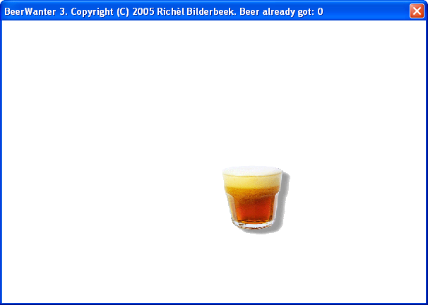

### [black_box](https://github.com/richelbilderbeek/black_box)

### [Boenken](https://github.com/richelbilderbeek/Boenken)

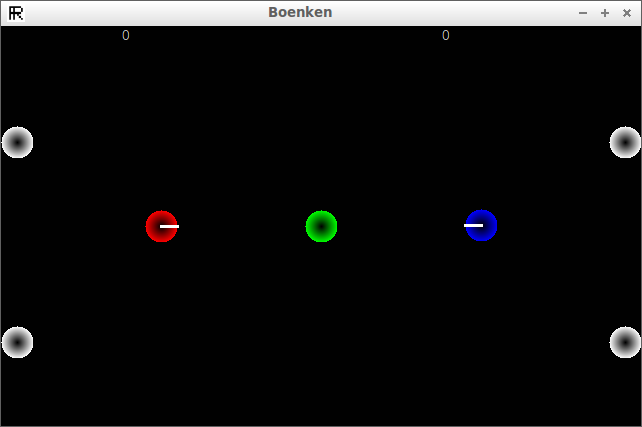

### [Carnaval Tic-Tac-Toe](https://github.com/richelbilderbeek/carnaval_tic_tac_toe)

### [CityOfThieves](https://github.com/richelbilderbeek/CityOfThieves)

### [ConnectThree](https://github.com/richelbilderbeek/ConnectThree)

### [Conquer Chess](https://github.com/richelbilderbeek/conquer_chess)

### [Corridor](https://github.com/gnudles/corridor)

A game by gnudles, that I ported to Qt Creator.

### [DasWahreSchlagerfest](https://github.com/richelbilderbeek/DasWahreSchlagerfest)

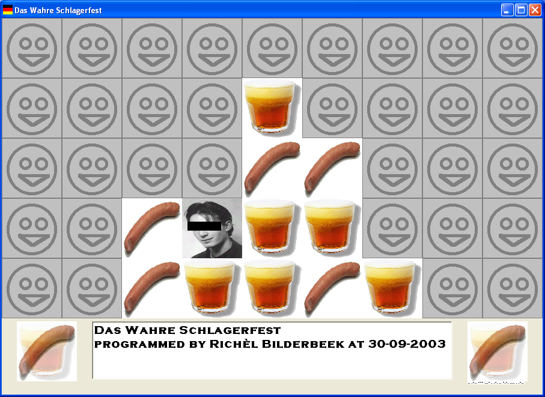

### [GameOfLifeFighter](https://gitlab.com/luckeyproductions/GameOfLifeFighter)

A game I made together with Frode Lindeijer.

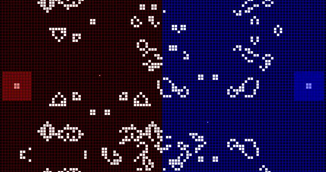
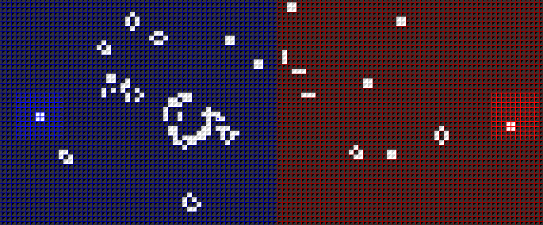

### [hunter_game](https://github.com/richelbilderbeek/hunter_game)

A game by Rolf F. Storms.

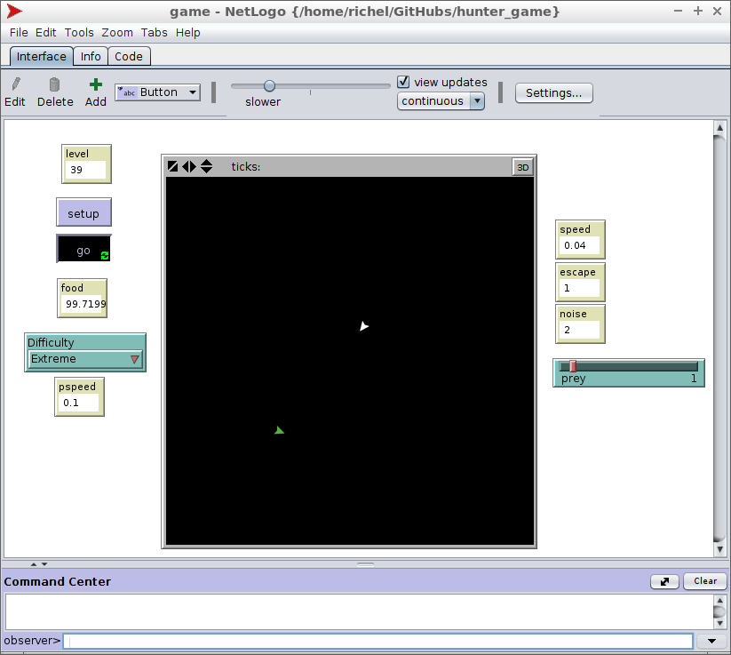

### [K3OpEenRij](https://github.com/richelbilderbeek/K3OpEenRij)

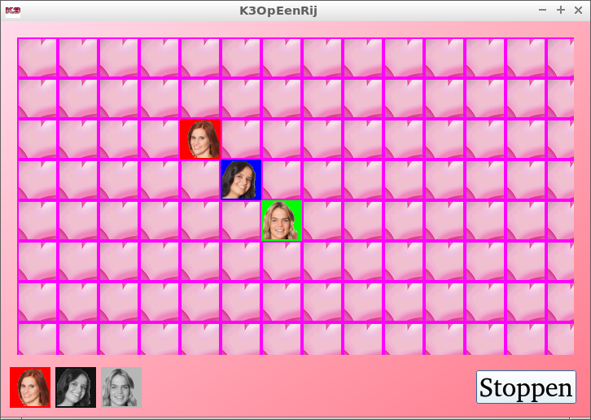

### [Knokfighter](https://github.com/richelbilderbeek/Knokfighter)

A game I made together with Joost van den Bogaart.

### [LonelierPong](https://github.com/richelbilderbeek/LonelierPong)

### [MartianCafeTuinemaTycoon](https://github.com/richelbilderbeek/MartianCafeTuinemaTycoon)

A game by Joost van den Bogaart.

### [Maziak](https://github.com/richelbilderbeek/Maziak)

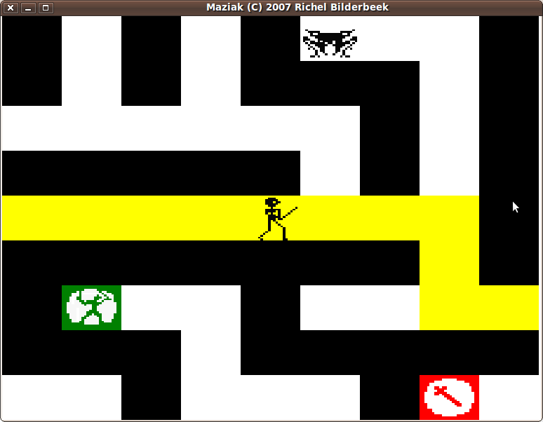

### [Nature Zen](https://github.com/richelbilderbeek/djog_unos_2018)

A god simulator by Team Octane,
which was put on [Steam](https://store.steampowered.com/app/1080960/Nature_Zen/).

### [PokeVolley](https://github.com/richelbilderbeek/PokeVolleyVcl)

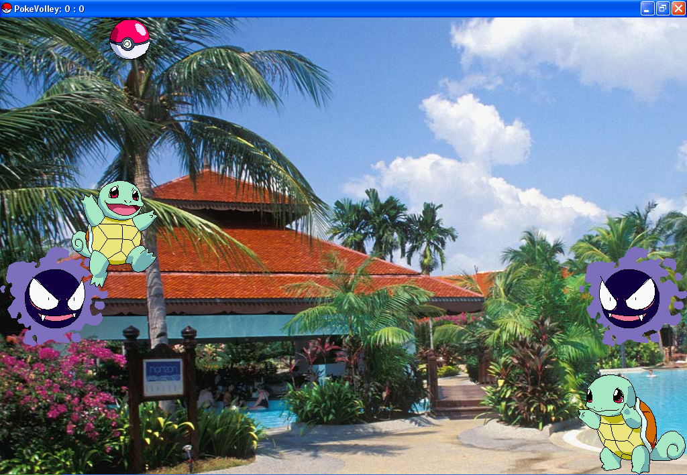

### [Pong 3D](https://github.com/richelbilderbeek/pong_3d)

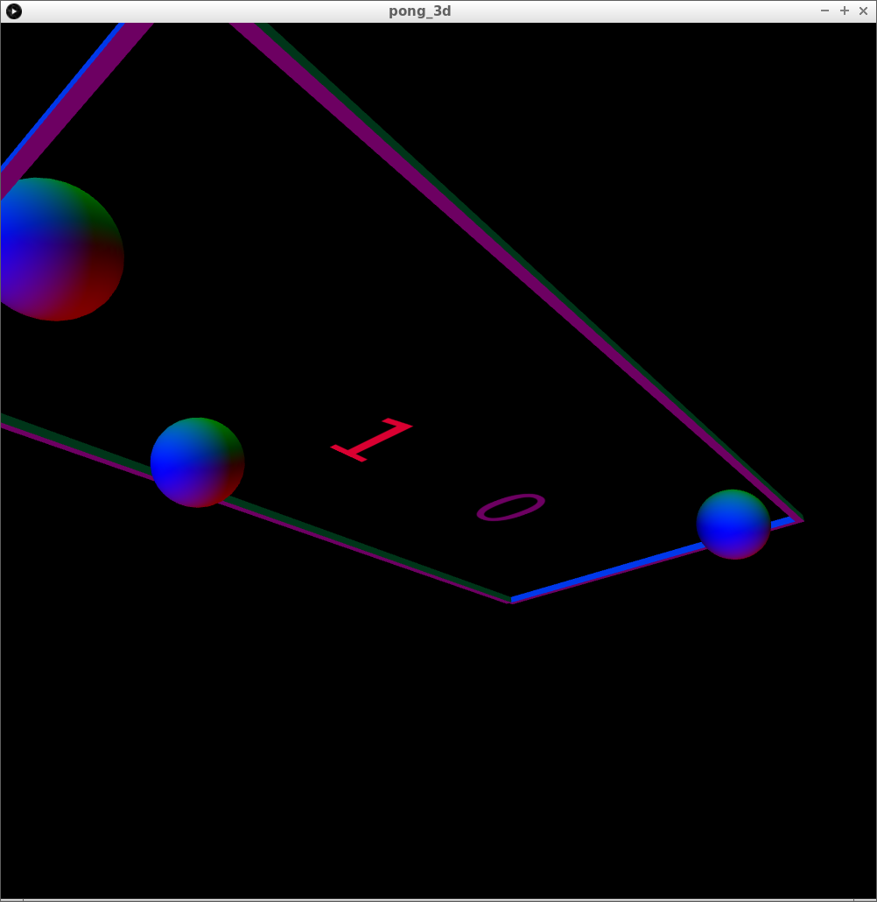

### [Pron](https://github.com/richelbilderbeek/Pron)

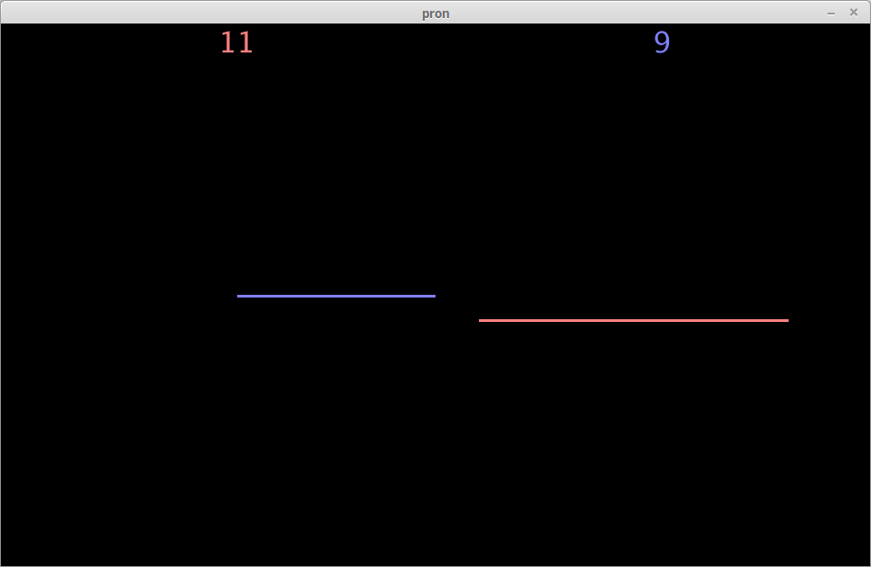

### [Prong](https://github.com/richelbilderbeek/Prong)

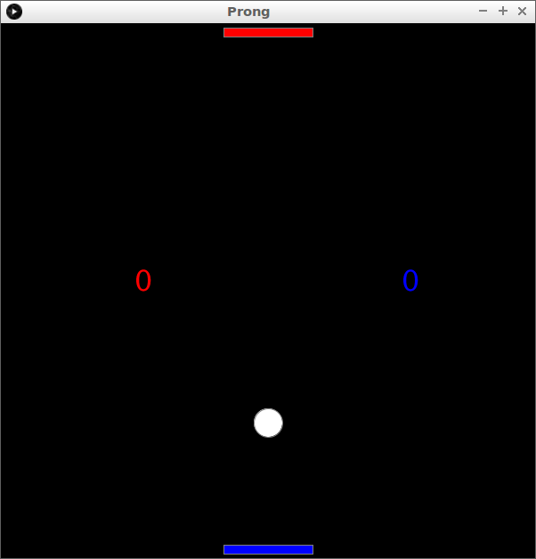

### [ProPokeVolley](https://github.com/richelbilderbeek/ProPokeVolley)

### [ProtonTank](https://github.com/richelbilderbeek/ProtonTank)

### [PublicToiletManager](https://github.com/richelbilderbeek/PublicToiletManager)

A game by Joost van den Bogaart.

### [Pylos](https://github.com/richelbilderbeek/Pylos)

### [Reversi](https://github.com/richelbilderbeek/Reversi)

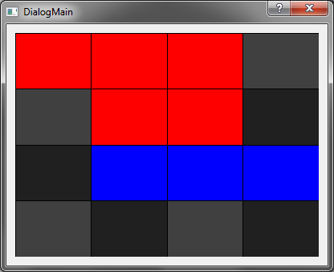

### [ReversiVcl](https://github.com/richelbilderbeek/ReversiVcl)

### [RubiksClock](https://github.com/richelbilderbeek/RubiksClock)

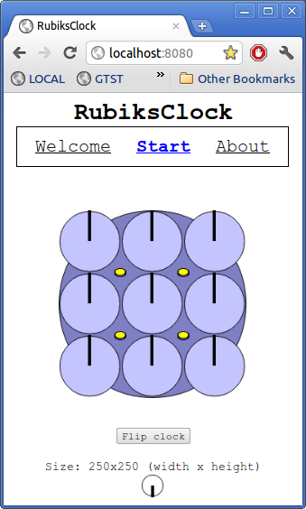

### [SearchAndDestroyChess](https://github.com/richelbilderbeek/SearchAndDestroyChess)

### [Sim Equation](https://github.com/richelbilderbeek/sim_equation)

### [SpaceHarry](https://github.com/richelbilderbeek/SpaceHarry)

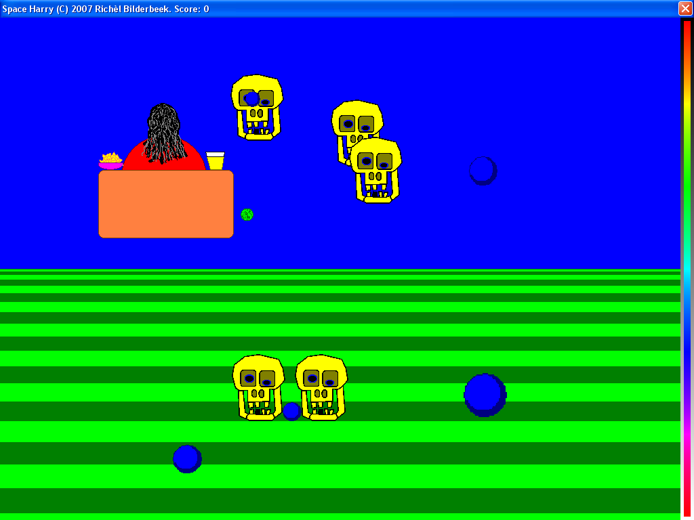

### [Tank Battalion](https://github.com/djog/tank_battalion)

A recreation of the arcade game Tank Battalion 
by the DJOG Uno's 2020 team in Processing.

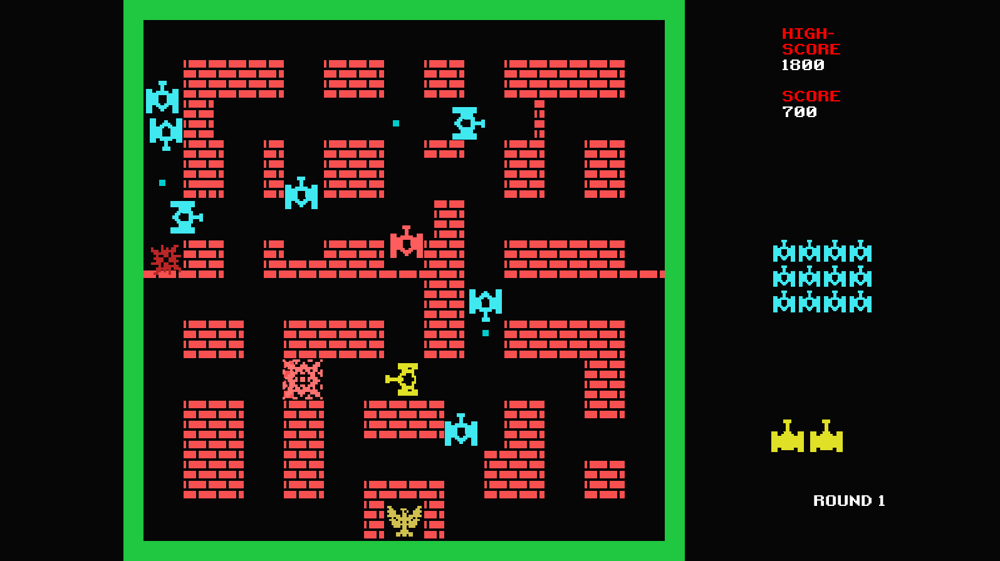

### [TicTacToe](https://github.com/richelbilderbeek/TicTacToe)

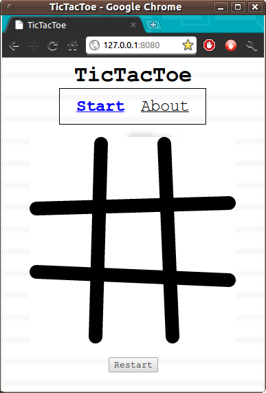
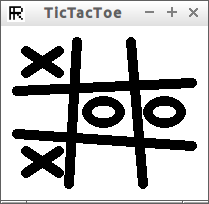

### [TronCollection](https://github.com/richelbilderbeek/TronCollection)

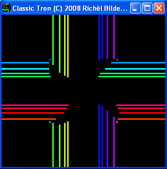

### [WizardBattle](https://github.com/richelbilderbeek/WizardBattle)

A game by Joost van den Bogaart.

### [Zork](https://github.com/richelbilderbeek/Zork)

A game by Tim Anderson, Marc Blank, Dave Lebling and Bruce Daniels,
that I ported to Qt Creator.

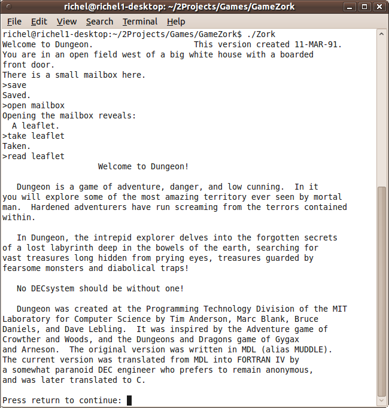

## Complete and maintained games

I am in the process of using GitHub Actions for Continuous Integration.
Project with a Travis CI build badge are not yet converted.

### C++

 * 

### Processing

## Incomplete and actively worked on
 

## Complete, but unmaintained games

Most of these use the Windows-only VCL library. Most of these I made
cross-platform using the Qt library.

 * [BeerWanter (VCL)](https://github.com/richelbilderbeek/BeerWanterVcl)
 * [Boenken (VCL)](https://github.com/richelbilderbeek/BoenkenVcl)
 * [Das Wahre Schlagerfest (VCL)](https://github.com/richelbilderbeek/DasWahreSchlagerfestVcl)
 * [K3-Op-Een-Rij (VCL)](https://github.com/richelbilderbeek/K3OpEenRijVcl)
 * [Knokfighter (VCL)](https://github.com/richelbilderbeek/Knokfighter)
 * [Maziak (VCL)](https://github.com/richelbilderbeek/MaziakVcl)
 * [Met Z'n Drieen (VCL)](https://github.com/richelbilderbeek/MetZnDrieenVcl) (Dutch)
 * [PokeVolley (VCL)](https://github.com/richelbilderbeek/PokeVolleyVcl)
 * [Reversi Console (VCL)](https://github.com/richelbilderbeek/ReversiConsoleVcl)
 * [Rubik's Clock (VCL)](https://github.com/richelbilderbeek/RubiksClockVcl)
 * [SearchAndDestroyChess (VCL)](https://github.com/richelbilderbeek/SearchAndDestroyChessVcl)
 * [SimPredator (VCL)](https://github.com/richelbilderbeek/SimPredator)
 * [SpaceHarry (VCL)](https://github.com/richelbilderbeek/SpaceHarry)
 * [The Tron Collection (VCL)](https://github.com/richelbilderbeek/TronCollectionVcl)

## Completed games by others that I ported

The games I wish I had made, and had to port myself to enjoy them.

## Games by others that I host the code of

The games made by others I host the code of. No coding from me was
involved in these games.

 * [Martian Cafe Tuinema Tycoon](https://github.com/richelbilderbeek/MartianCafeTuinemaTycoon)
 * [Public Toilet Manager 5](https://github.com/richelbilderbeek/PublicToiletManager)
 * [Wizard Battle](https://github.com/richelbilderbeek/WizardBattle)

## Games by others I cheated at

The games made by others that I created a cheat or trainer for.

 * [Astro Menace](https://github.com/richelbilderbeek/AstroMenaceCheat)
 * [Breath Of Fire 2](https://github.com/richelbilderbeek/BreathOfFire2Trainer)

## Games by others

The games I wish I had made...

 * [Meritous](https://github.com/richelbilderbeek/Meritous)

## Incomplete and maintained
 
 * [Dissolved](https://github.com/richelbilderbeek/Dissolved)
 * [Eukaryote](https://github.com/richelbilderbeek/Eukaryote)
 * [EverythingToPiecesShooter](https://github.com/richelbilderbeek/EverythingToPiecesShooter)
 * [XeNonZero](https://github.com/richelbilderbeek/XeNonZero)

## Online radio's

 * [https://rainwave.cc](https://rainwave.cc)
 * [http://www.rpgamers.net/](http://www.rpgamers.net/)
 * [https://www.kohina.com/](https://www.kohina.com/)
 * [https://stream.msxall.com/public/msxall](https://stream.msxall.com/public/msxall)
 * [https://www.radio.net/s/retropcgame](https://www.radio.net/s/retropcgame)

## Links to older games

 * [https://dosgamezone.com/](https://dosgamezone.com/)
