# Games

My collection of games.

All these games are licenced under the GPL 3.0 licence.

This page consists of:

 * Gallery: graphical overview of all my games
 * Build statuses: show the build statuses of all of my games

## Gallery

Ordered alphabetically

### [AminoAcidFighter](https://github.com/richelbilderbeek/AminoAcidFighter)

### [Beer simulation game](https://github.com/richelbilderbeek/beer_sim)

### [BeerWanter](https://github.com/richelbilderbeek/BeerWanter)

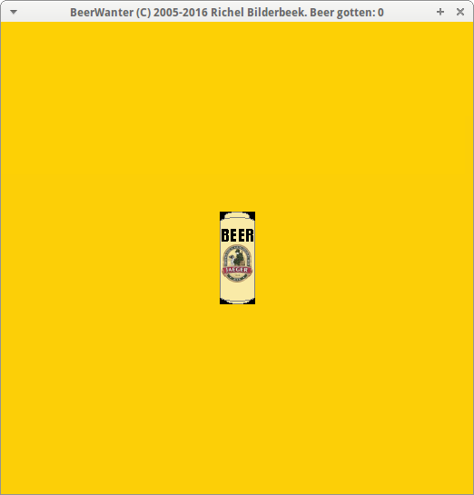

### [BeerWanter 2](https://github.com/richelbilderbeek/BeerWanter2)

### [BeerWanterVcl](https://github.com/richelbilderbeek/BeerWanterVcl)

### [black_box](https://github.com/richelbilderbeek/black_box)

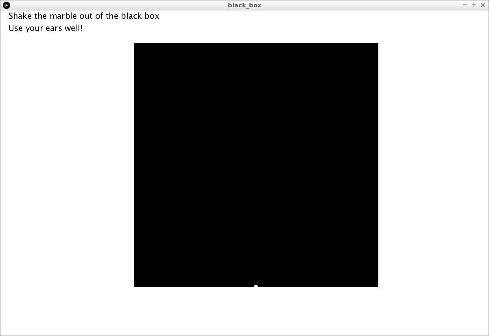

### [Boenken](https://github.com/richelbilderbeek/Boenken)

### [Carnaval Tic-Tac-Toe](https://github.com/richelbilderbeek/carnaval_tic_tac_toe)

### [CityOfThieves](https://github.com/richelbilderbeek/CityOfThieves)

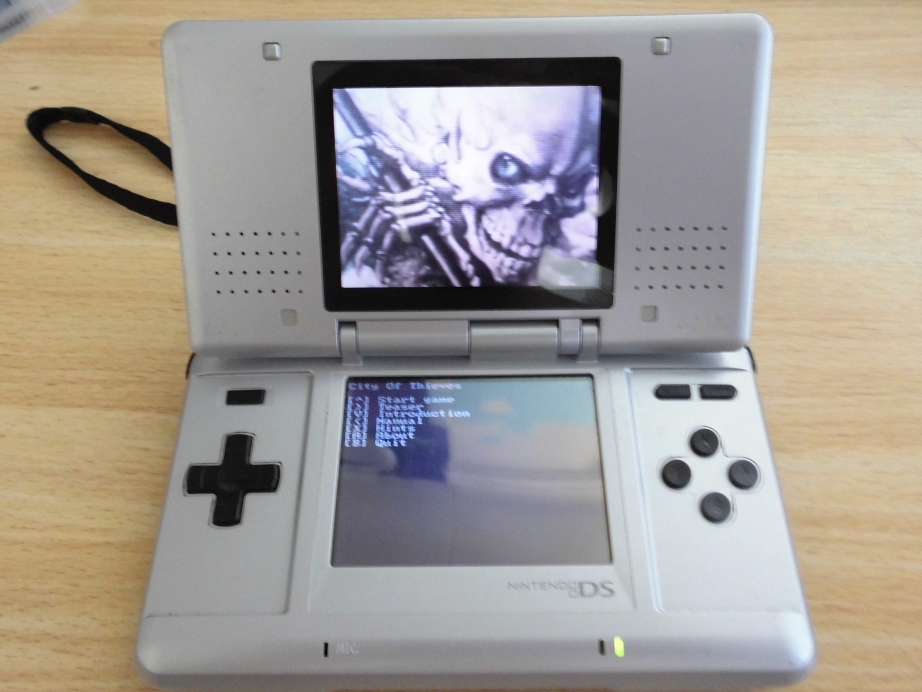
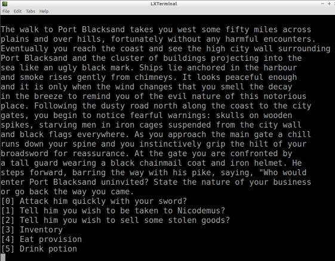
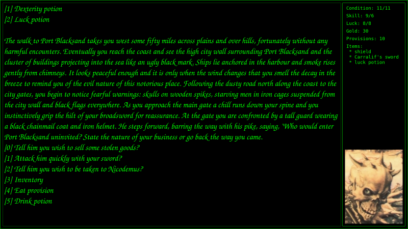

### [ConnectThree](https://github.com/richelbilderbeek/ConnectThree)

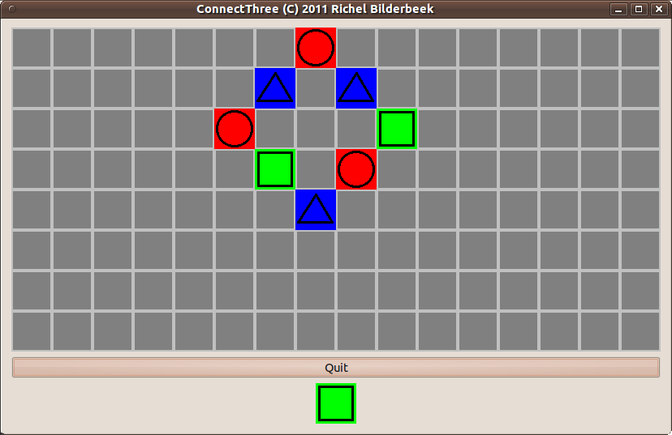
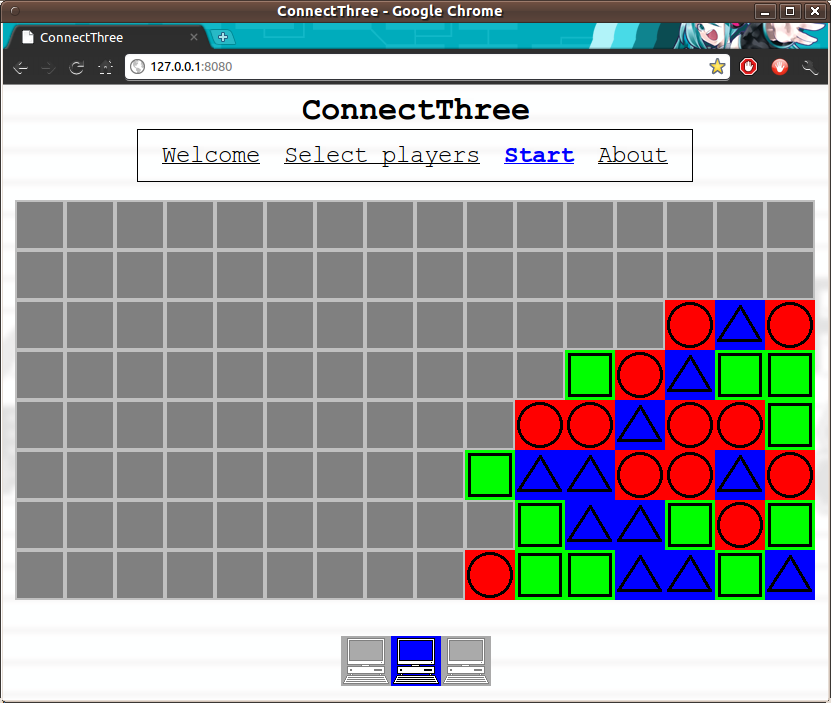

### [Corridor](https://github.com/richelbilderbeek/Corridor)

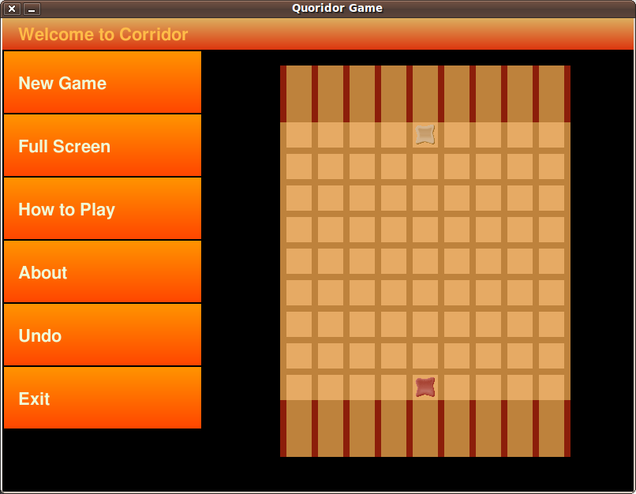

### [DasWahreSchlagerfest](https://github.com/richelbilderbeek/DasWahreSchlagerfest)

### [GameOfLifeFighter](https://gitlab.com/luckeyproductions/GameOfLifeFighter)

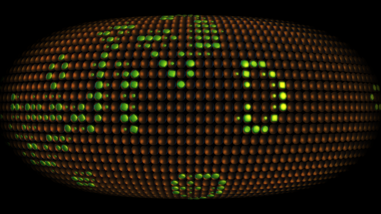

### [hunter_game](https://github.com/richelbilderbeek/hunter_game)

### [K3OpEenRij](https://github.com/richelbilderbeek/K3OpEenRij)

### [Knokfighter](https://github.com/richelbilderbeek/Knokfighter)

### [LonelierPong](https://github.com/richelbilderbeek/LonelierPong)

### [MartianCafeTuinemaTycoon](https://github.com/richelbilderbeek/MartianCafeTuinemaTycoon)

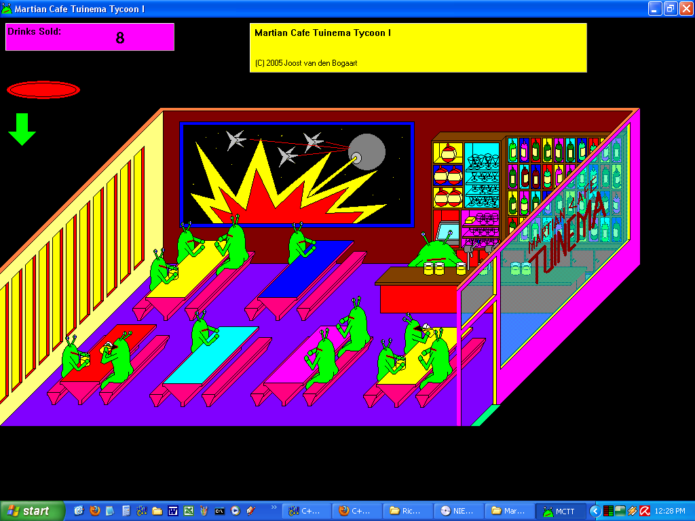

### [Maziak](https://github.com/richelbilderbeek/Maziak)

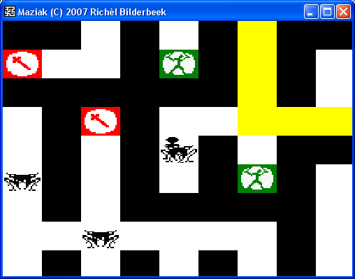

### [PokeVolley](https://github.com/richelbilderbeek/PokeVolleyVcl)

### [Pron](https://github.com/richelbilderbeek/Pron)

### [Prong](https://github.com/richelbilderbeek/Prong)

### [ProPokeVolley](https://github.com/richelbilderbeek/ProPokeVolley)

### [ProtonTank](https://github.com/richelbilderbeek/ProtonTank)

### [PublicToiletManager](https://github.com/richelbilderbeek/PublicToiletManager)

### [Pylos](https://github.com/richelbilderbeek/Pylos)

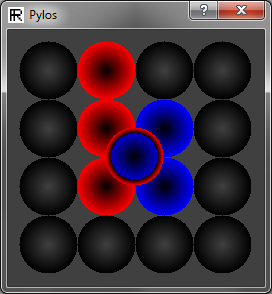

### [Reversi](https://github.com/richelbilderbeek/Reversi)

### [ReversiVcl](https://github.com/richelbilderbeek/ReversiVcl)

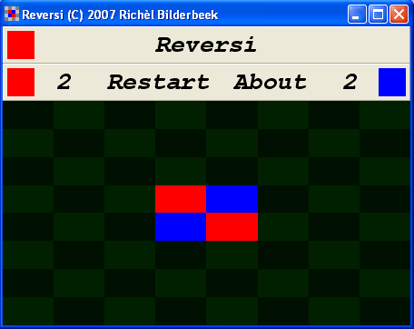

### [RubiksClock](https://github.com/richelbilderbeek/RubiksClock)

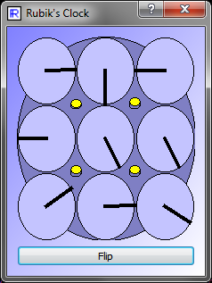

### [SearchAndDestroyChess](https://github.com/richelbilderbeek/SearchAndDestroyChess)

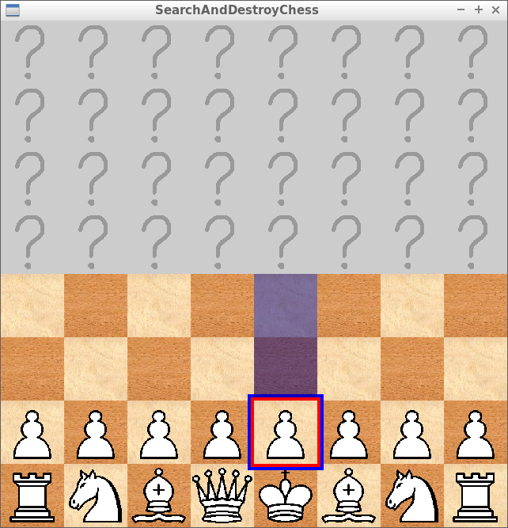

### [SpaceHarry](https://github.com/richelbilderbeek/SpaceHarry)

### [TicTacToe](https://github.com/richelbilderbeek/TicTacToe)

### [TronCollection](https://github.com/richelbilderbeek/TronCollection)

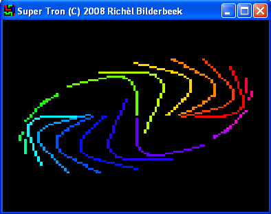

### [WizardBattle](https://github.com/richelbilderbeek/WizardBattle)

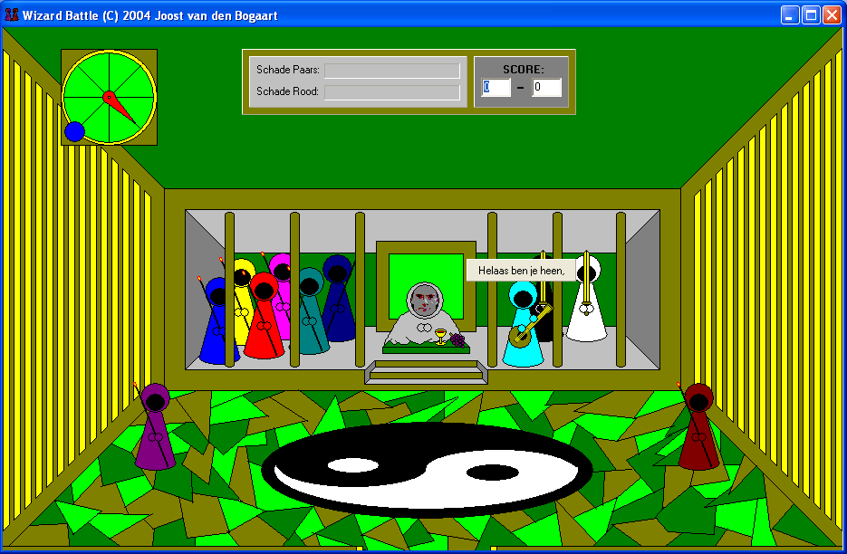

### [Zork](https://github.com/richelbilderbeek/Zork)

## Complete and maintained games

### C++

 *   [BeerWanter](https://github.com/richelbilderbeek/BeerWanter)
 *   [Boenken](https://github.com/richelbilderbeek/Boenken)
 *   [CityOfThieves](https://github.com/richelbilderbeek/CityOfThieves)
 *   [ConnectThree](https://github.com/richelbilderbeek/ConnectThree)
 *   [DasWahreSchlagerfest](https://github.com/richelbilderbeek/DasWahreSchlagerfest)
 *   [GameOfLifeFighter](https://gitlab.com/luckeyproductions/GameOfLifeFighter)
 *   [K3OpEenRij](https://github.com/richelbilderbeek/K3OpEenRij)
 *   [Maziak](https://github.com/richelbilderbeek/Maziak)
 *   [Pylos](https://github.com/richelbilderbeek/Pylos)
 *   [Reversi](https://github.com/richelbilderbeek/Reversi)
 *   [RubiksClock](https://github.com/richelbilderbeek/RubiksClock)
 *   [SearchAndDestroyChess](https://github.com/richelbilderbeek/SearchAndDestroyChess)
 *   [TicTacToe](https://github.com/richelbilderbeek/TicTacToe)

### Processing

 *  [BeerWanter2](https://github.com/richelbilderbeek/BeerWanter2)
 *  [Black Box](https://github.com/richelbilderbeek/black_box)
 *  [LonelierPong](https://github.com/richelbilderbeek/LonelierPong)
 *   [pong_3d](https://github.com/richelbilderbeek/pong_3d)
 *  [Pron](https://github.com/richelbilderbeek/Pron)
 *   [Prong](https://github.com/richelbilderbeek/Prong)
 *   [ProPokeVolley](https://github.com/richelbilderbeek/ProPokeVolley)
 *   [ProtonTank](https://github.com/richelbilderbeek/ProtonTank)

## Incomplete and actively worked on
 
 *   [AminoAcidFighter](https://github.com/richelbilderbeek/AminoAcidFighter)
 *   [SimpleKeeper](https://github.com/richelbilderbeek/SimpleKeeper)

## Complete, but unmaintained games

Most of these use the Windows-only VCL library. Most of these I made
cross-platform using the Qt library.

 * [BeerWanter (VCL)](https://github.com/richelbilderbeek/BeerWanterVcl)
 * [Boenken (VCL)](https://github.com/richelbilderbeek/BoenkenVcl)
 * [Das Wahre Schlagerfest (VCL)](https://github.com/richelbilderbeek/DasWahreSchlagerfestVcl)
 * [K3-Op-Een-Rij (VCL)](https://github.com/richelbilderbeek/K3OpEenRijVcl)
 * [Knokfighter (VCL)](https://github.com/richelbilderbeek/Knokfighter)
 * [Maziak (VCL)](https://github.com/richelbilderbeek/MaziakVcl)
 * [Met Z'n Drieen (VCL)](https://github.com/richelbilderbeek/MetZnDrieenVcl) (Dutch)
 * [PokeVolley (VCL)](https://github.com/richelbilderbeek/PokeVolleyVcl)
 * [Reversi Console (VCL)](https://github.com/richelbilderbeek/ReversiConsoleVcl)
 * [Rubik's Clock (VCL)](https://github.com/richelbilderbeek/RubiksClockVcl)
 * [SearchAndDestroyChess (VCL)](https://github.com/richelbilderbeek/SearchAndDestroyChessVcl)
 * [SimPredator (VCL)](https://github.com/richelbilderbeek/SimPredator)
 * [SpaceHarry (VCL)](https://github.com/richelbilderbeek/SpaceHarry)
 * [The Tron Collection (VCL)](https://github.com/richelbilderbeek/TronCollectionVcl)

## Completed games by others that I ported

The games I wish I had made, and had to port myself to enjoy them.

 *  [Corridor](https://github.com/richelbilderbeek/Corridor)
 *  [Zork](https://github.com/richelbilderbeek/Zork)

## Games by others that I host the code of

The games made by others I host the code of. No coding from me was
involved in these games.

 * [Martian Cafe Tuinema Tycoon](https://github.com/richelbilderbeek/MartianCafeTuinemaTycoon)
 * [Public Toilet Manager 5](https://github.com/richelbilderbeek/PublicToiletManager)
 * [Wizard Battle](https://github.com/richelbilderbeek/WizardBattle)

## Games by others I cheated at

The games made by others that I created a cheat or trainer for.

 * [Astro Menace](https://github.com/richelbilderbeek/AstroMenaceCheat)
 * [Breath Of Fire 2](https://github.com/richelbilderbeek/BreathOfFire2Trainer)

## Games by others

The games I wish I had made...

 * [Meritous](https://github.com/richelbilderbeek/Meritous)

## Incomplete and maintained
 
 * [Dissolved](https://github.com/richelbilderbeek/Dissolved)
 * [Eukaryote](https://github.com/richelbilderbeek/Eukaryote)
 * [EverythingToPiecesShooter](https://github.com/richelbilderbeek/EverythingToPiecesShooter)
 * [Tank Battalion](https://github.com/richelbilderbeek/TankBattalion)
 * [XeNonZero](https://github.com/richelbilderbeek/XeNonZero)

